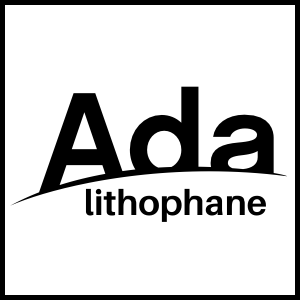
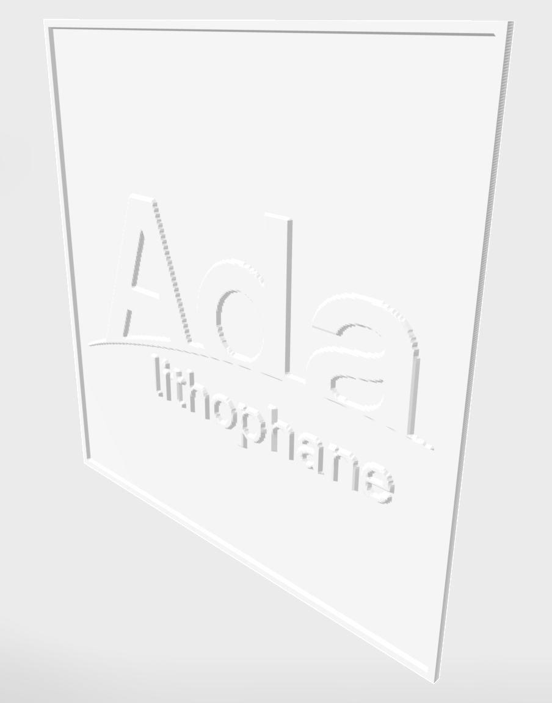

# lithophane
[](https://ada-lang.io/docs/arm)
[](https://alire.ada.dev/crates/lithophane)

Create [lithophane](https://en.wikipedia.org/wiki/Lithophane) of your favourite picture with Ada.





**Usage**
```
lithophane [options] <input_file>
```

`<input_file>` is the picture to convert (any format supported by
[GID](https://gen-img-dec.sourceforge.io): PNG, JPEG, BMP, GIF, TGA, ...).

**Options**
```
-h --help
-v --version
-b --save-binary          (default)
-a --save-ascii
-p --save-pgm
-o<name> --output-name=<name>
-H<height> --height=<height>
-f<filter> --filter=<filter>
-c<file> --config=<file>
```

| Option | Description |
| --- | --- |
| `-h`, `--help` | print usage and exit |
| `-v`, `--version` | print the program version and exit |
| `-b`, `--save-binary` | write the lithophane as a binary STL file: `<output-name>.bin.stl` (this is the default output if no `-a`/`-b`/`-p` flag is given) |
| `-a`, `--save-ascii` | write the lithophane as an ASCII STL file: `<output-name>.ascii.stl` |
| `-p`, `--save-pgm` | also dump the grayscale-converted image as a PGM file: `<output-name>.pgm` |
| `-o<name>`, `--output-name=<name>` | base name used for every output file above (default: `test`) |
| `-H<height>`, `--height=<height>` | target height of the lithophane |
| `-f<filter>`, `--filter=<filter>` | image filter to apply before conversion |
| `-c<file>`, `--config=<file>` | read options from a config file instead of (or in addition to) the command line; when given, it overrides any previous option |

You can combine `-a`, `-b` and `-p`: each one adds its own output file, they are
not mutually exclusive.

**Config file**

`-c`/`--config` points to a TOML file such as [config.toml](config.toml):
```toml
input-name = "foo.png"
output-name = "test"
filter = "threshold"
save-ascii = false
save-binary = true
save-pgm = true
height = 10
```

> [!NOTE]
> `-f`/`--filter`, `-H`/`--height` and `-c`/`--config` are already accepted on
> the command line but are not wired up yet: filters, height scaling and the
> config file are parsed but have no effect on the generated STL for now
> (see TODO below). The only filter currently applied is a fixed threshold at
> mid-grey, done automatically when saving to binary STL.

**TODO**
* add resize option
* add filters option
* add borders option
* add height option


Based on [GID](https://gen-img-dec.sourceforge.io)

