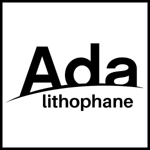
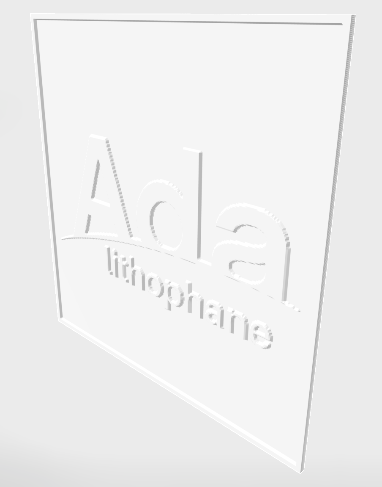

# lithophane
[](https://ada-lang.io/docs/arm)
[](https://alire.ada.dev/crates/lithophane)

Create [lithophane](https://en.wikipedia.org/wiki/Lithophane) of your favourite picture with Ada.





**Build**
```
alr build
```

**Usage**
```
bin/lithophane [options] <input_file>
```

`<input_file>` is the picture to convert (any format supported by
[GID](https://gen-img-dec.sourceforge.io): PNG, JPEG, BMP, GIF, TGA, ...).

**Options**
```
-h --help
-v --version
-b --save-binary          (default)
-a --save-ascii
-m --save-3mf
-p --save-pgm
-o<name> --output-name=<name>
-H<height> --height=<height>
-B<border> --border=<border>
--dimensions=<W>x<H>x<D>
-f<filter> --filter <filter> [<n>]
-t<threshold> --threshold=<threshold>
-M<max_size> --max_size=<max_size>
-c<file> --config=<file>
```

| Option | Description |
| --- | --- |
| `-h`, `--help` | print usage and exit |
| `-v`, `--version` | print the program version and exit |
| `-b`, `--save-binary` | write the lithophane as a binary STL file: `<output-name>.bin.stl` (this is the default output if no `-a`/`-b`/`-p` flag is given) |
| `-a`, `--save-ascii` | write the lithophane as an ASCII STL file: `<output-name>.ascii.stl` |
| `-m`, `--save-3mf` | write the lithophane as a 3MF file: `<output-name>.3mf` (a ZIP/OPC package with a welded, watertight mesh as `3D/3dmodel.model`) |
| `-p`, `--save-pgm` | also dump the grayscale-converted image as a PGM file: `<output-name>.pgm` |
| `-o<name>`, `--output-name=<name>` | base name used for every output file above (default: `test`) |
| `-H<height>`, `--height=<height>` | maximum relief height, in millimetres (a positive number, default `10.0`): the highest point of the relief lies at `Z = <height>`, i.e. the brightest pixel is raised to exactly this height and the others proportionally to their grey level. The flat base sits below `Z = 0` (from `Z = -2`), so the total thickness of the part is `<height> + 2`. |
| `-B<border>`, `--border=<border>` | width, in pixels, of the border added around the image (default: `20`) |
| `--dimensions=<W>x<H>x<D>` | target physical size **of the 3MF output**, in millimetres (3MF is unit-aware, STL is not). Each axis with a non-zero value is scaled to it exactly; an axis left empty or `0` follows the first constrained axis so the model keeps its proportions. `X`/`Y` are centred on the origin. Example: `--dimensions=100x100x1.5`, or `--dimensions=120x0x0` to set the width and let height and depth scale with it. |
| `-f<filter>`, `--filter <filter> [<n>]` | image filter to apply before conversion; `<filter>` is one of `bartlett`, `gauss`, `square`, `sharpen`, `none`. The optional number `<n>` right after the filter name is the kernel size (an odd number, default `3`). |
| `-t<threshold>`, `--threshold=<threshold>` | grey level, from `0.0` to `1.0` (default `0.5`), below which pixels are cut to `0.0`. The threshold is always applied; use `0` to keep every pixel. |
| `-M<max_size>`, `--max_size=<max_size>` | maximum image dimension, in pixels, border included (default `1500`, `0` = no limit). When the image is wider or taller than this, it is shrunk (nearest-neighbour, aspect ratio preserved) so its larger side equals `<max_size>` before the mesh is built. |
| `-c<file>`, `--config=<file>` | read options from a config file instead of (or in addition to) the command line; when given, it overrides any previous option |

You can combine `-a`, `-b`, `-m` and `-p`: each one adds its own output file,
they are not mutually exclusive.

The `<n>` argument is positional and optional, so both of these work:
```
bin/lithophane --filter gauss 5 doc/img/ada.logo.png
bin/lithophane --filter sharpen doc/img/ada.logo.png
```

**Config file**

`-c`/`--config` points to a TOML file such as [config.toml](doc/example/config.toml):
```toml
input-name = "foo.png"
output-name = "test"
filter = "sharpen"
filter_size = 3
filter_threshold = 0.5
border_size = 20
save-ascii = false
save-binary = true
save-3mf = false
save-pgm = true
height = 10.0
max_size = 1500
dimensions = { width = 100.0, height = 100.0, depth = 1.5 }
```

Every key is optional; a missing key keeps its default. `filter_size` must be a
positive odd integer, `filter_threshold` must be a float in `0.0..1.0`, `height` must be a
positive number, and `border_size` and `max_size`
must be non-negative integers (`max_size = 0` means no limit), otherwise the key is ignored. `dimensions` is an
inline table (`width` / `height` / `depth`, in millimetres, applied to the 3MF
output); any sub-key may be omitted or set to `0` to leave that axis
proportional. The config file is read at the point where `-c`/`--config`
appears on the command line, so options placed *after* it still take effect.

> [!NOTE]
> `-f`/`--filter` and `-c`/`--config` are wired up: the selected filter (and its
> size) is applied to the grayscale image before the STL is
> generated, and the config file overrides the matching settings.
> `-B`/`--border` is wired up too: it sets the white margin added around the
> image before conversion. A threshold filter is always applied after
> conversion; its cut level (`0.5`, mid-grey, by default) is set with
> `-t`/`--threshold` or `filter_threshold`.

Based on [GID](https://gen-img-dec.sourceforge.io)

